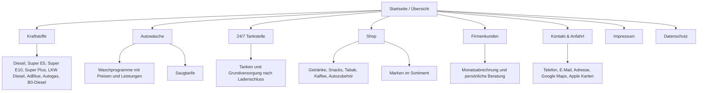
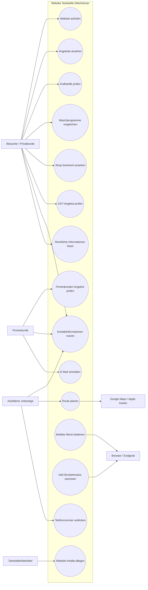
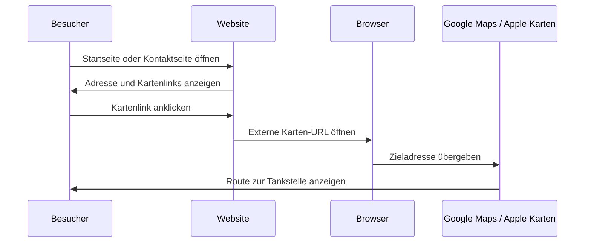
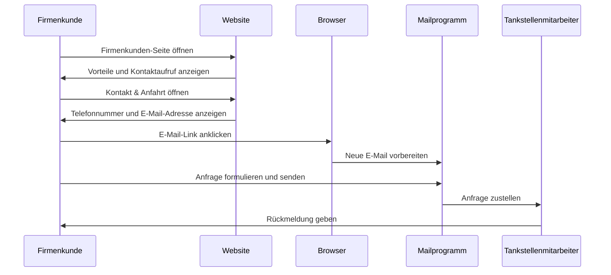
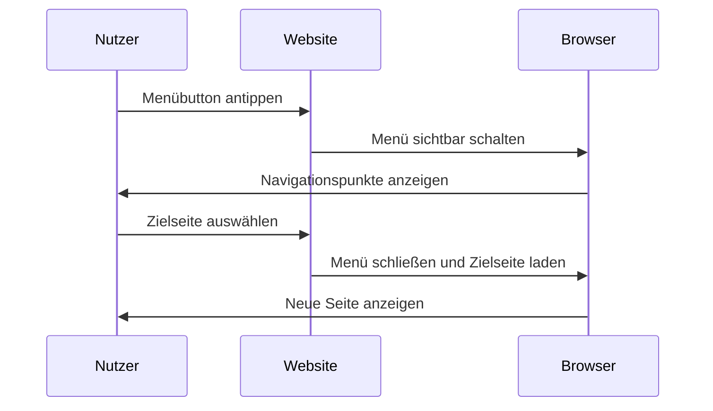
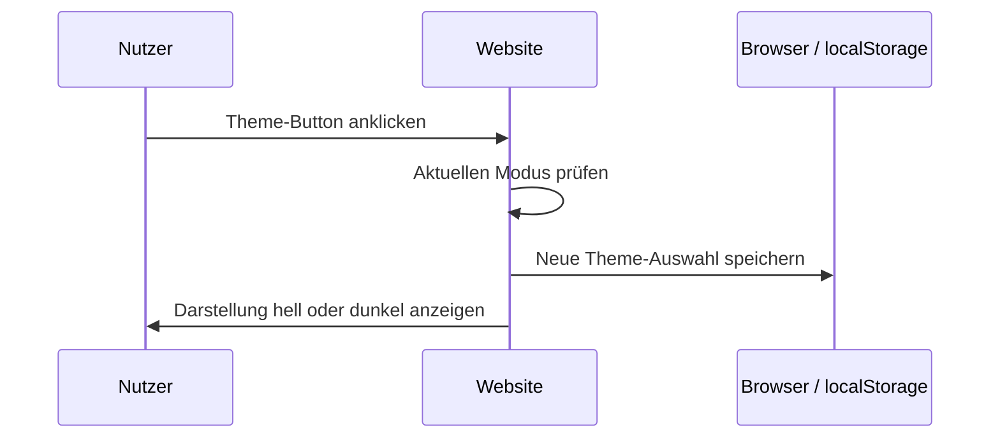
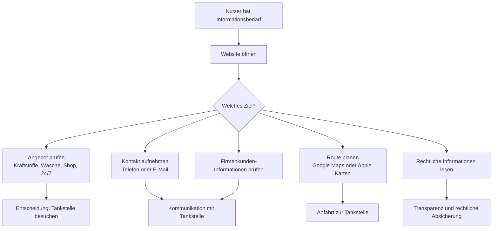

# Diagramme zum Webseiten-Auftritt der Tankstelle Oberholzner

## Ebene 1: Website-Struktur / Sitemap

Zweck: Dieses Diagramm zeigt den groben Aufbau der Website und welche Seiten über die Navigation erreichbar sind.

## Ebene 2: Rollen und Funktionen

Zweck: Diese Darstellung zeigt, welche Nutzergruppen mit welchen Funktionen der Website interagieren.

### Rollen-Funktions-Matrix

| Rolle | Ziel auf der Website | Wichtige Funktionen |
|---|---|---|
| Besucher / Privatkunde | Sich schnell über Tankstelle, Angebote und Standort informieren | Startseite aufrufen, Kraftstoffe ansehen, Waschprogramme vergleichen, Shop-Sortiment ansehen, Kontaktseite öffnen |
| Autofahrer unterwegs | Schnell entscheiden, ob die Tankstelle passt und wie man dorthin kommt | Standort ansehen, Route über Google Maps oder Apple Karten öffnen, Telefonnummer anklicken |
| Waschstraßenkunde | Waschprogramme und Saugtarife vergleichen | Autowäsche-Seite öffnen, Preise prüfen, enthaltene Leistungen vergleichen |
| Shop-Kunde | Sortiment und Marken prüfen | Shop-Seite öffnen, Kategorien und Marken ansehen |
| Firmenkunde | Informationen zu Monatsabrechnungen und regelmäßiger Nutzung erhalten | Firmenkunden-Seite öffnen, Vorteile prüfen, Kontakt per E-Mail oder Telefon aufnehmen |
| Tankstellenbetreiber / Inhaltsverantwortlicher | Informationen bereitstellen und aktuell halten | Inhalte, Preise, Kontaktangaben, Impressum und Datenschutz pflegen |
| Externer Kartendienst | Routenplanung ermöglichen | Google-Maps- oder Apple-Karten-Link öffnen |
| Browser / Endgerät | Darstellung und Interaktion ermöglichen | Seiten anzeigen, mobiles Menü öffnen/schließen, Hell-/Dunkelmodus speichern |

### Use-Case-Übersicht

## Ebene 3: Wichtigste Abläufe / Swimlane-Diagramme

Zweck: Diese Diagramme zeigen, was zeitlich passiert und welche Rolle beziehungsweise welches System beteiligt ist.

### Ablauf 1: Besucher plant eine Route zur Tankstelle

### Ablauf 2: Firmenkunde nimmt Kontakt wegen Monatsabrechnung auf

### Ablauf 3: Nutzer bedient mobiles Menü und wechselt die Seite

### Ablauf 4: Nutzer wechselt den Hell-/Dunkelmodus

## Ebene 4: Ereignisse

Zweck: Die Ereignisliste fasst aus Sicht eines Informationssystems zusammen, welche Auslöser welche Folgen haben.

| Ereignis | Auslöser | Folge |
|---|---|---|
| Website aufgerufen | Besucher öffnet die Startseite | Startseite mit Überblick, Kontakt und Angeboten wird angezeigt |
| Navigationspunkt gewählt | Besucher klickt auf eine Seite im Menü | Gewählte Inhaltsseite wird geladen |
| Mobiles Menü geöffnet | Nutzer tippt auf den Menübutton | Navigationsmenü wird eingeblendet |
| Mobiles Menü geschlossen | Nutzer klickt auf Link, außerhalb des Menüs oder drückt Escape | Navigationsmenü wird ausgeblendet |
| Theme gewechselt | Nutzer klickt auf Hell-/Dunkelmodus-Button | Darstellung wechselt und Auswahl wird im Browser gespeichert |
| Kraftstoffangebot angesehen | Besucher öffnet die Kraftstoff-Seite | Kraftstoffarten und Beschreibungen werden angezeigt |
| Waschprogramm angesehen | Besucher öffnet die Autowäsche-Seite | Waschprogramme, Preise, Leistungen und Saugtarife werden angezeigt |
| Shop-Sortiment angesehen | Besucher öffnet die Shop-Seite | Kategorien, Produkte und Marken werden angezeigt |
| Firmenkunden-Angebot geprüft | Firmenkunde öffnet die Firmenkunden-Seite | Vorteile der Monatsabrechnung und Kontaktaufruf werden angezeigt |
| Kontaktseite geöffnet | Nutzer klickt auf Kontakt & Anfahrt | Telefonnummer, E-Mail, Adresse und Kartenlinks werden angezeigt |
| Telefonnummer angeklickt | Nutzer klickt auf die Telefonnummer | Telefon-App oder Telefonfunktion wird geöffnet |
| E-Mail-Adresse angeklickt | Nutzer klickt auf die E-Mail-Adresse | Mailprogramm wird mit Empfängeradresse geöffnet |
| Route geplant | Nutzer klickt auf Google Maps oder Apple Karten | Externer Kartendienst öffnet die Route zur Tankstelle |
| Impressum geöffnet | Nutzer klickt auf Impressum | Rechtliche Anbieterinformationen werden angezeigt |
| Datenschutz geöffnet | Nutzer klickt auf Datenschutz | Informationen zur Datenverarbeitung werden angezeigt |

## Kurzlogik des Webseiten-Auftritts

