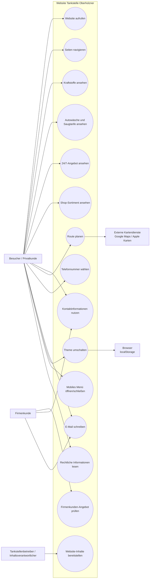
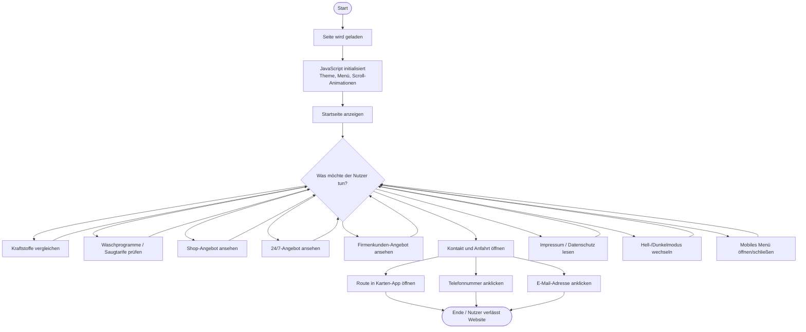
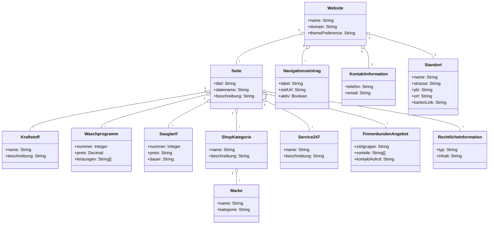
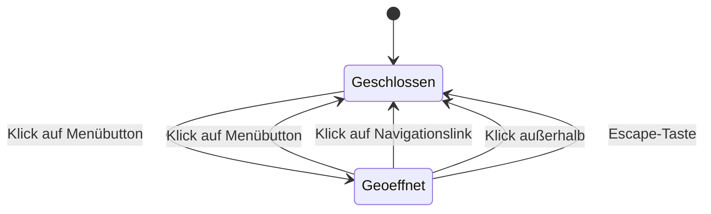
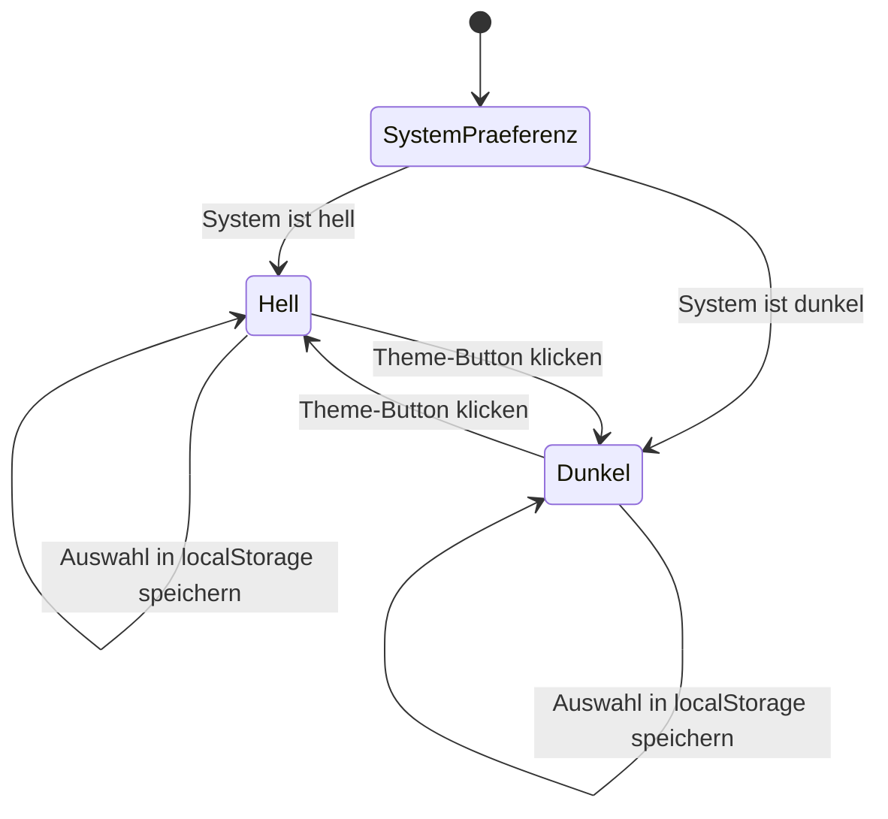

# UML-Diagramme zum Webseiten-Auftritt

## 1. Use-Case-Diagramm: Organisationssicht und Funktionen

## 2. Aktivitätsdiagramm: Typischer Besuch der Website

## 3. Klassendiagramm: Datenelemente des Auftritts

## 4. Zustandsdiagramm: Mobiles Menü

## 5. Zustandsdiagramm: Hell-/Dunkelmodus

